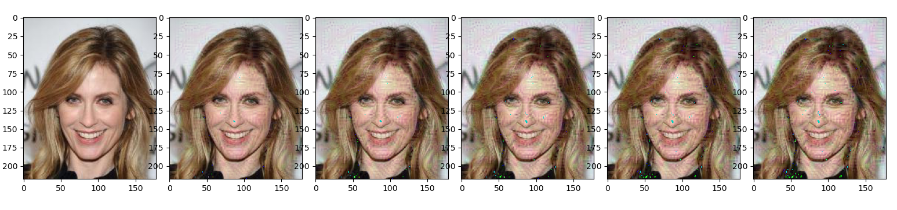

# Youth Visualizer - Visualizing Convolutional Network on CelebA Dataset

Yuan Wang & Jiajie Shi, 2021-6


## Abstract


## Running

Clone the repository. Extract the Celeb_A data set or other photos to the directory following the specification. 

To run the program, use `python main.py`. 

Might need to adjust some parameters to get the optimal result. 

## Dataset

We used the CelebFaces Attributes Dataset (CelebA) dataset in the training and evaluation. "CelebA is a large-scale face attributes dataset with more than 200K celebrity images, each with 40 attribute annotations." [2] 

We trained our network on the label "Young" in order to get some face attribute filters that are related to the youth of a face.

## Model and Training

We used the Darknet64 as our initial model. The model has 5 convolutional layers, each batch normalized by a batch-normalization layer, activated by a RELU layer, and max-pooled using kernel_size=2 and stride=2. At each step, the size of the input is reduced to a quarter, with the number of channels doubled (from 16 channels at the first output). The final layer's output is then converted to a 256-length tensor using an average pooling layer. A final fully connected layer then produce two outputs using a 256*2 fully connected layer. 

The training code is adapted from the tutorials of UW CSE 455 [3]. Training is done on Colab using a GPU accelerator. 

Training statistics:

```
{
	'epoch':
	'schedule':
	'learning_rate': 0.01, 
	'momentum': 0.9, 
	'decay': 0.0005
	'batch_size': 128
}
```

The accuracies of the training set and the test sets of the model are:

```
{
	'train': 0.882812
	'test': 0.899858
}
```
here is the graph of our training:


## Visualization

#### Activated areas

First, we want to visualize the convolutional layers by seeing what areas are activated. By passing in the input to the convolutional layers, and visualize each output channel separately, we would be able to see which part is activated the most. We got 16 output at layer 1, 32 outputs at layer 2, and 64 outputs at layer 3. For further layers, the image size is reduced so much that it barely make any sense to us. The results are shown below:

The original image is image number 19 (000019.jpg) from the our data set:


**The output of the first layer:**


Observations and discussions:

For output 1 and 16, we can see that the eyes, lips, and nose is relatively more activated that other facial features. This could be contributed to the fact that these parts are darker than the surrounding area, which then become the concentration of the filters. 

For output 8, 9, 12 and 13, we could clearly see the edges, with the output 13 showing some vertical edges and output 12 showing some horizontal edges. Edge detection could be useful in later layers, as we detect more wrinkles, hair, and other attributes.

For output 10 and 14, the filter is strongly activated on the edges of hair, eyebrow, and lips. These are certainly interesting features that might be associated with the youngness of a face. 

**The output of the second layer:**


Observations and discussions:

The output at the second layer is more abstract and pixelized. But we could still see some general edges among output2 (tilted and vertical), output 24 and 25 (mostly horizontal), and output 26, 27 (mostly vertical). This suggests edge detection is still happening. 

Beyond visual edges, we can see that in some output, the background and the majority of the hair is lost. Instead, the filter focused on the outline of the eyes, lip, nose, and hair. For example, output 9 has the left-eye, hair, nose, and mouse strongly activated. Output 19 also have a similar characteristic. 

**The output of the third layer:**


The layer has become harder to interpret. However, we could still see some patterns. Output 26 is having a strong contrast around the head and the cheeks, which are some common facial recognition patterns. Output 51 and 54 are again focusing on the eyes and mouse, suggesting these features have some importance. 

Interestingly, we see a contrast in activation in output 18, 26, and 54 on the upper-right head. The image itself does not appear to have something special around the area. This might suggest the potential focus of some hair pin or other jewels. Or it could simply because the hair is lighter. 

**The output of the fourth layer**:

 

The output of this layer is chopped to the first 64 channels. There are a few output that very interesting to point out.

Output 2, 9 both have a significant focus on the hair and upper-head. This could be suggesting some baldness recognition or hair recognition. This feature is, by our common assumption, associated with the youngness of a face. 

By contrast, for the image number 51, we get the following output at filter 2 and 9. The output is somewhat reverted as compared to the output from this image, further suggesting the recognition of baldness/hairiness of a face. 


**The output at the fifth layer**: 

These results are not understandable to our standard. We put them here for demonstration. 


**Side Note: RGB-ize convolutional output**

We also implemented a method that could put some channels of the output together to form an RGB image. The resulting images have some brilliant artisticity. A sample result is shown at the beginning of the document. 

Another interesting result we get of this example image:


The first rgb-ed image is using 3 channels (10, 14, 13) from the output of the first layer. We can see the red color on the edge of the face and the eyebrow, showing that the red channel is activated around these features. We can also see the blue channel across the edges of the photo, especially the hair. We can also see some green color around the hair as well, showing these filters are triggered by the features. 

The last rgb image is using 3 channels (51, 54, 64) from the output of the third layer. We can see that the green channel has a peek around the eyes and the upper hair. It is somewhat harder to tell about the other channels. 

#### Activate a filter

From the previous part, it naturally leads to the question that whether we can tell if some filter is specifically interested in some known features? For example, baldness, lips, eyes, hairs etc. In order to verify our assumptions, we decided manually activate some layers by adjusting our input, see how the layer can be activated the most, and to search for some patterns from the changes to our input. 

We do so by using an algorithm similar to deep dream, except we are starting from a specified channel at a layer. We calculate a gradient that makes the layer more "activated", back-propagate the gradient all the way to the input, change the input according to the gradient. To define "activate", we think of 3 approaches. With y=f(x), our approaches result in the gradient as below:

0. We take the sum of the output from the channel. The gradient at each element would be 1. We try to increment the output as a whole.
   
   
   
1. We take the sum of the squared output. Instead of making the whole output higher, we want to make the contrast of the output stronger. That is, make large numbers larger and smaller numbers smaller. By taking the sum of the square, the gradient at the output tensor would be 2 times the value itself.  

   

2. We take the sum of the absolute value of the output. Since many output elements might have value within range 0~1, the approach above could cause diminishing outputs. Hence, we can just make positive values more positive and negative values more negative. The gradient would be 1 for positive outputs, and -1 for negative outputs. 
   
   )

The following experiments are based on this picture of a group member. Layer begin with index 1, channel begin with index 0. 


Here are some interesting results:

**General Eyes/Nose/Mouth (Layer1, channel 11, schema 0):**


This is an interesting case, in which we can see the outline of the face being activated, but unable to see what the filter is recognizing from the input. We think that the filter is detecting face outlines by contrasting nose/lip/eyes to nearby skin colors. As the cheek changes blue, the filter is able to react stronger to the outlines of the face (red contrasts to blue), and resulted in the overall increase of activation. 

**Red Lip / Hair (Layer2, channel 24, schema 0)**:


To activate this channel more, we can see that the input's lip becomes more red, indicating that the layer can be activated with red-lips. In the output, we can also see that the lip is contrasting stronger to the surrounding cheeks (cheeks whitened). The resulting image also has hair tainted blue and skin more light, probably suggesting some pattern in the hair/face color as well. 

**Eye Shadow (Layer3, channel 27, schema 2)**:


In this image we can see that the activated channel has caused the image to have purple eyeshadows and purple lips. This is a good example of how we find some human-recognizable patterns from convolutional layers. This also shows what kind of patterns the filter is trying to recognize. 

**Red/blue spot/lines (Layer 4, channel 44, schema 1)**:


This is also an interesting case. The blue/red dots/lines generated by the channel certainly did not come from the original image. Therefore, activating this layer has revealed something that this layer remembers. That is, the layer can be activated if there are horizontal wrinkles or dots on the input. This is something the layer has learned from the training set, including the positions of the dots and the directions of the lines. 

There could be two possible explanations. One, the red/blue dot is a feature of the human face or some other decorations, that could help in classifying faces to young/old. Or the layer has overfitted to some special cases in the training set. 

**Layer 5**:

Activation at level 5 is hard to explain. The result is severely pixelized. We think this might be attribute the use of max_pooling layers, which results in the gradient to be only passed to some pixels. We suggest that if the network is trained using avg_pooling layers we could get better results.  

#### Age Shifting

Using our result of a neural network classifying youth and a deep dream algorithm, what is it like to make someone look younger or older?

We do the deep dream algorithm from the classification result of the network, changing only the input based on the gradient from the losses.

First, we would make some young to become old (000178.jpg):



This is quite apparent that we have deepened some of the wrinkles of the image. Probably this feature has contributed to the classification of old. 

Then we would make some old to become young (000125.jpg):


Actually, this is harder to explain. We think the random edges among the head is resembling hair of some kind. 

## Takeaways

This project gave us hand-on experience with choosing and manipulating a dataset, training a neural network, toning the hyperpramaters, anaylize outcomes and the implementation of a deep dream algorithm.

[And more detailed takeways on technical stuff maybe]

Our group decided to do this program because we are interested in what is Youth and it seems asking neural network to classify Youth and then look at what it "thinks" can be an interesting conversation.

Data is clearly a poor reflection of the truth but it reflects one way or another how our society has viewed what is Youth. Neural network is a great tool for feature extracting and by looking at the hidden layers of it we are able to see some "most efficient biases" for defining Youth in our society, which is interesting and has the potential to be useful beyond our prototyping attempt. Maybe this technique can be used more in social science domain.

According to the observation of our neural network, we found features like lip color, baldness, make up(eye shadow), smoothness of skin... Some of them are closer to the biological truth like smoothness of skin and some of them are more socially constriucted like use of make up. 

We are also surprised at how excited we felt looking at the thousands of photos the neural network and the deep dream made during project. It was from the joy of accomplishment, but also, it's also because some of the pictures we got are extremly artistic.(This is how we decide to make the RGB combiner). Feeding a neural network some data of a topic and then look at how it "look" at things is certainly a practice of high artistic quality. Maybe for understanding different interesting concepts and visualizing them, deep dream can be a good help for artists.


Fun fact: we wanted to do this project on "beauty" but our neural network failed learn how to classfy it.


## References

1. Deep Dream:

   Wasilewska, A. W. (n.d.). *Google Deep Dream*. Stonybrook.Edu. Retrieved June 7, 2021, from https://www3.cs.stonybrook.edu/~cse352/T12talk.pdf

2. CelebA Dataset:

   ```
   @inproceedings{liu2015faceattributes,
    title = {Deep Learning Face Attributes in the Wild},
    author = {Liu, Ziwei and Luo, Ping and Wang, Xiaogang and Tang, Xiaoou},
    booktitle = {Proceedings of International Conference on Computer Vision (ICCV)},
    month = {December},
    year = {2015} 
   }
   ```

3. Training Code:

   Redmon, J. (n.d.). *pjreddie/uwimg*. GitHub. https://github.com/pjreddie/uwimg. 

